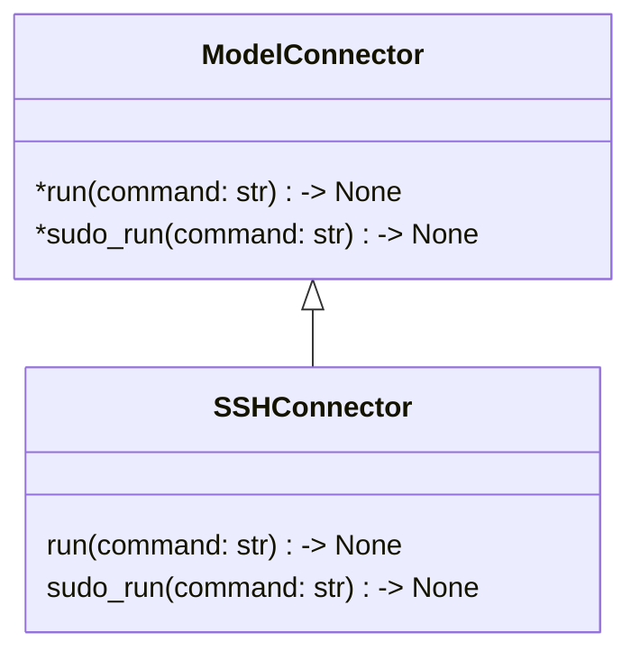
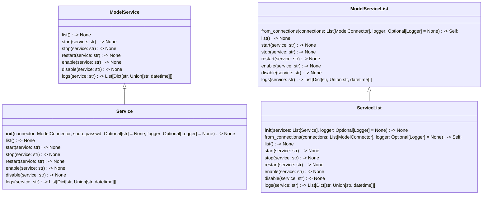
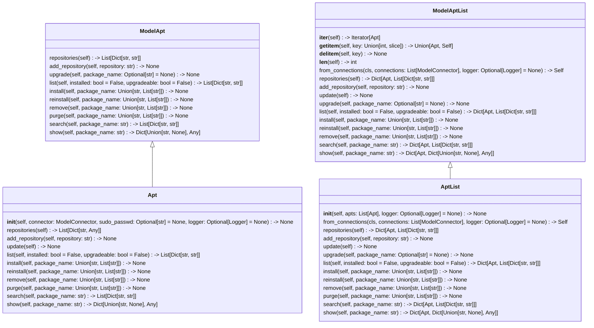

# Pardus

Pradus is a python package used for orchestrate a low level system fleet.

It has almost no dependency on client side. The only needed thing is an `ssh` server and a sudo user to connect to the
client.

## Models:

### Connections:
Connection is an object that allows one to create ssh connections and run commands on a remote client.




### Services:
Services is an object that allows one to alter services on remote client.




### Config:
Config is an object that allows one to alter configuration files on remote client.

```mermaid
classDiagram
    class ModelConfig {
        __setitem__(self, key: str, value: Dict[str, str]) -> None
        __delitem__(self, key: str) -> None
        update(self, *args, **kwargs) -> None
    }
    
    class Config {
        __init__(self, connector: ModelConnector, path: Union[str, Path], create: bool = False, backup: bool = False, force: bool = False, sudo_passwd: Optional[str] = None, logger: Optional[Logger] = None) -> None
        __setitem__(self, key: str, value: Dict[str, str]) -> None
        def __delitem__(self, key: str) -> None
        clear(self) -> None
        update(self, *args, **kwargs) -> None
        touch(self) -> None
        exist(self, the_file: Optional[Union[str, Path]] = None) -> bool
        create_backup(self) -> None
        read(self) -> str
        __update(self) -> None
    }

    class ModelConfigList {
        __setitem__(self, key: str, value: Dict[str, str]) -> None
        __delitem__(self, key: str) -> None
        update(self, *args, **kwargs) -> None
    }

    class ConfigList {
        __init__(self, configs: List[Config], logger: Optional[Logger] = None)
        __setitem__(self, key: str, value: Dict["str", "str"]) -> None
        __delitem__(self, key) -> None
        from_connections(cls, connections: List[ModelConnector], files: Union[Union[str, Path], List[Union[str, Path]]], sudo_passwds: Optional[Union[str, List[str]]] = None, logger: Optional[Logger] = None) -> Self
        update(self, *args, **kwargs) -> None
        length(self) -> int
        take_element(self, index: int) -> None
        get_element(self, key: Union[int, slice]) -> Union[Config, Self]
        clear(self) -> None
    }
    
    class ConfigRaw {
        __init__(self, connector: ModelConnector, path: Union[str, Path], create: bool = False, backup: bool = False, force: bool = False, sudo_passwd: Optional[str] = None, logger: Optional[Logger] = None) -> None
        __str__(self) -> str
        __len__(self) -> int
        data(self) -> str
        data(self, data) -> None
        read(self) -> str
        exist(self, the_file: Optional[Union[str, Path]] = None) -> bool
        create_backup(self) -> None
        touch(self) -> None
        __update(self) -> None
    }

    ModelConfig <|-- Config
    ModelConfigList <|-- ConfigList
```




### Apt:
Apt is an object that allows one to install/remove, etc. on remote client.



## Example:

### Connection:

Creating an ssh connection.

```python
from pardus import SSHConnector
from logging import getLogger

ssh_connection = SSHConnector("address", 22, "username", "password")

```

### Services:

Service object creation.

```python
from pardus import SSHConnector, Service
from logging import getLogger

ssh_connection = SSHConnector("address", 22, "username", "password")
services = Service(ssh_connection)

```

### Config:

Config object creation.

```python
from pardus import SSHConnector, Config
from logging import getLogger

ssh_connection = SSHConnector("address", 22, "username", "password")
config = Config(ssh_connection, "/etc/samba/smb.conf")

```

### Apt:

Apt object creation.

```python
from pardus import SSHConnector, Apt

ssh_connection = SSHConnector("address", 22, "username", "password")
apt = Apt(ssh_connection)

```
